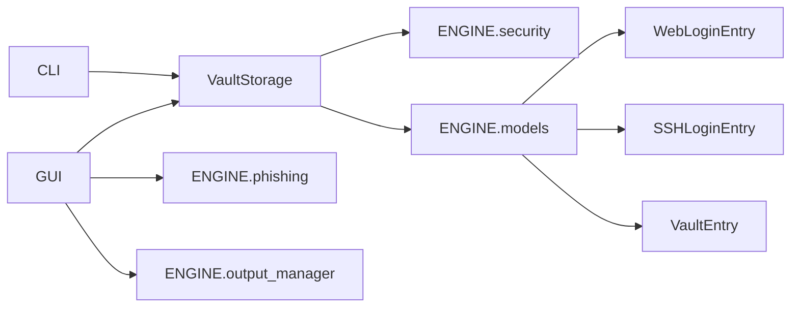
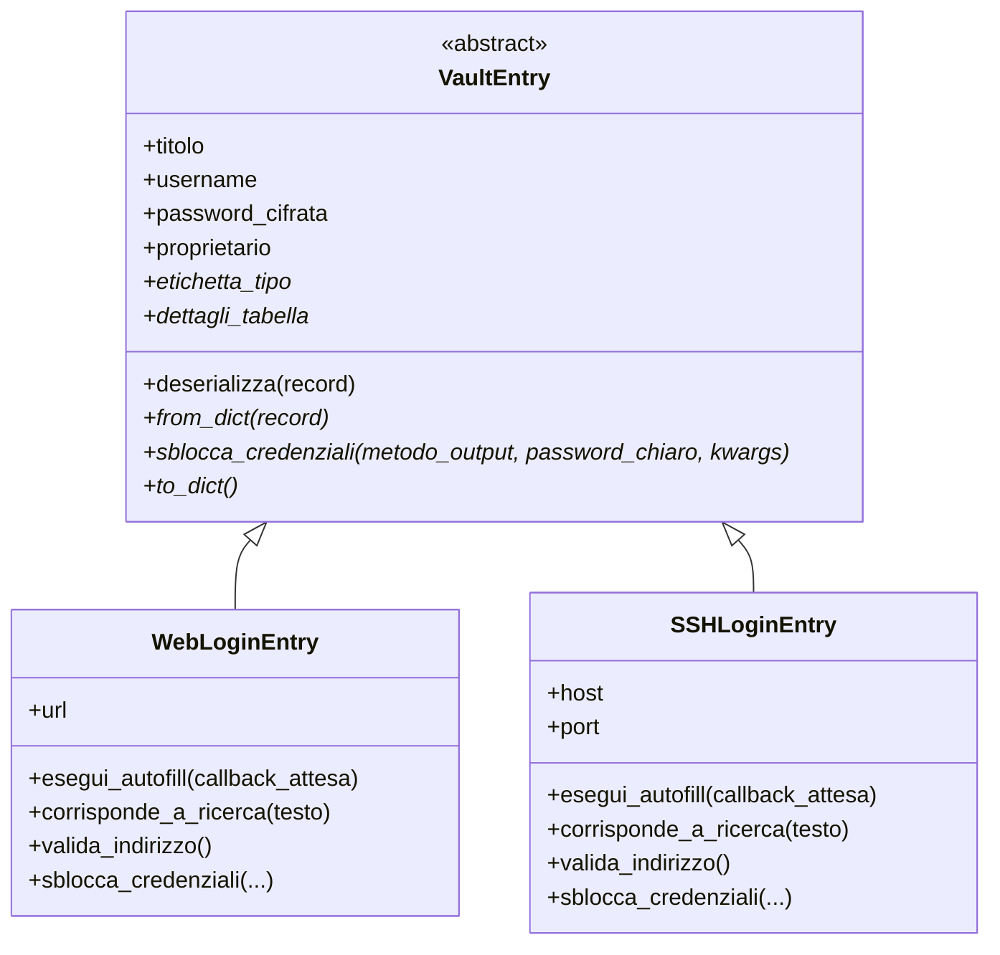

# Manuale Tecnico

## Panoramica

PassGuardian è organizzato in due livelli principali:

- `ENGINE`, che contiene la logica di dominio, la persistenza e la sicurezza;
- `GUI`, che contiene finestre, dialoghi e navigazione dell'interfaccia grafica.

In parallelo esiste una CLI che riusa gli stessi moduli dell'ENGINE senza passare dalla GUI.

## Flusso generale

1. L'utente accede o si registra.
2. Lo storage locale verifica la Master Password o crea il profilo utente.
3. Le credenziali vengono caricate dal JSON e decifrate solo in memoria.
4. La dashboard mostra i record come oggetti polimorfici.
5. Le operazioni di sblocco, modifica, ricerca e anti-phishing vengono delegate ai moduli dell'ENGINE.



## Gerarchia di classi

Il requisito di ereditarietà è soddisfatto dalla gerarchia delle credenziali.



### Perché l'ereditarietà ha senso qui

`VaultEntry` rappresenta il comportamento comune di ogni credenziale: dati base, serializzazione, deserializzazione e sblocco.
`WebLoginEntry` e `SSHLoginEntry` sono davvero due varianti dello stesso concetto di dominio, non oggetti senza relazione forzata.

Il polimorfismo è usato in più punti:

- `VaultEntry.deserializza()` ricostruisce dinamicamente la sottoclasse corretta a partire dal campo `tipo` nel JSON;
- la dashboard mostra righe generiche leggendo proprietà comuni come `etichetta_tipo` e `dettagli_tabella`;
- il flusso di sblocco chiama `sblocca_credenziali()` senza dover conoscere in anticipo se la credenziale è Web o SSH.

`super()` viene usato nelle sottoclassi per estendere l'inizializzazione comune del genitore e aggiungere i campi specifici.

## Moduli dell'ENGINE

### `ENGINE/models/base.py`

Contiene `VaultEntry`, classe astratta base del modello.
Gestisce il registro dei tipi concreti tramite `registra_tipo()` e la deserializzazione polimorfica con `deserializza()`.

### `ENGINE/models/web.py`

Contiene `WebLoginEntry`.
Gestisce URL, anti-phishing locale basato sulla distanza di Levenshtein e autofill per le credenziali web.

### `ENGINE/models/ssh.py`

Contiene `SSHLoginEntry`.
Gestisce host, porta, validazione dell'indirizzo e autofill per la connessione SSH.

### `ENGINE/storage.py`

Contiene `VaultStorage`.
Si occupa di:

- registrazione utenti;
- verifica delle credenziali principali;
- salvataggio e caricamento delle credenziali;
- aggiornamento e cancellazione dei record;
- cambio della Master Password con ricifratura completa.

La persistenza è basata su JSON locale. Le credenziali vengono cifrate con una chiave derivata dalla Master Password tramite PBKDF2-HMAC-SHA256, quindi non sono memorizzate in chiaro.

### `ENGINE/security.py`

Contiene le primitive di cifratura e decifratura.
Il formato dei token include versione, salt, nonce, ciphertext e tag di integrità.

### `ENGINE/phishing.py`

Contiene le funzioni di analisi URL e la logica di confronto contro:

- credenziali salvate dall'utente;
- whitelist globale di brand fidati.

La distanza di Levenshtein viene usata come euristica per rilevare typosquatting.

### `ENGINE/output_manager.py`

Contiene i canali fisici di erogazione:

- clipboard;
- digitazione simulata;
- autofill completo per Web e SSH.

## GUI

La classe `PassGuardianApp` in `GUI/app.py` coordina la navigazione tra le schermate:

- splash screen;
- login;
- registrazione;
- dashboard.

Le schermate sono state scritte come componenti separati per evitare una finestra monolitica.

La dashboard contiene la tabella centrale, la ricerca avanzata, i pulsanti di azione e i dialoghi modali per aggiunta, modifica, cambio password e controllo phishing.

## Formati dati

### `vault.json`

La struttura attesa è simile a questa:

```json
{
	"utenti": {
		"username": "hash_sha256_della_master_password"
	},
	"credenziali": [
		{
			"tipo": "web",
			"titolo": "...",
			"username": "...",
			"password_cifrata": "...",
			"proprietario": "username",
			"url": "..."
		}
	]
}
```

### `whitelist.json`

Contiene una lista di domini affidabili usati nei controlli anti-phishing.

## Dipendenze principali

- `customtkinter` per la GUI;
- `pyautogui` per la digitazione simulata;
- `pyperclip` per la clipboard;
- `pytest` per i test;
- `cryptography` è presente tra le dipendenze del progetto, anche se la cifratura attuale è gestita dal modulo locale `ENGINE.security`.

## Punti di attenzione

- Il core è scritto per funzionare anche senza GUI, quindi le funzioni dell'ENGINE non devono dipendere da widget o callback grafici.
- La logica di accesso al vault assume che il JSON sia coerente; i metodi di lettura ricostruiscono una struttura base se il file manca o è corrotto.
- La ricerca e il controllo URL filtrano la tabella visiva, ma non alterano il contenuto reale del vault.
